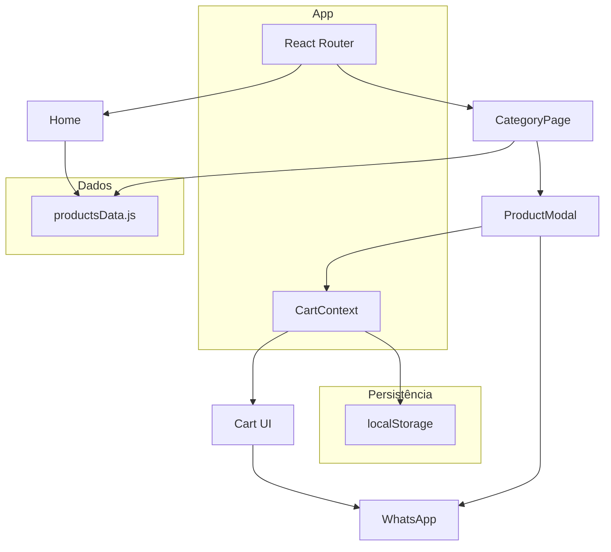

# Migração do site Bemvirá para React

## Objetivos

- Reescrever o front em **React** (Vite).
- **Loading page** para pré-carregar imagens críticas antes de exibir o conteúdo.
- Visual **mais moderno e profissional** (tipografia, espaçamento, micro-interações).
- **Mobile first**: melhor responsividade e layout (carrinho, modais, navegação).

---

## 1. Stack e estrutura do novo projeto


| Tecnologia          | Uso                                                                                               |
| ------------------- | ------------------------------------------------------------------------------------------------- |
| **Vite + React 18** | Build e componentes                                                                               |
| **React Router 6**  | Rotas: `/` (home), `/produtos`, `/produtos/:categoria` (opcional para SEO e URLs compartilháveis) |
| **Context API**     | Carrinho + persistência em `localStorage`                                                         |
| **CSS**             | Tailwind CSS (recomendado para responsivo rápido e visual consistente) ou CSS Modules             |


Estrutura de pastas sugerida (dentro do repositório, ex.: pasta `app/` ou criar projeto na raiz e mover o atual para `legacy/`):

```
app/
├── public/           # favicon, og:image (ou manter Cloudinary)
├── src/
│   ├── assets/       # imagens estáticas se necessário
│   ├── components/   # Header, Footer, Cart, Modal, LoadingScreen...
│   ├── pages/        # Home, CategoryPage, ou seções como componentes de página
│   ├── context/      # CartContext
│   ├── data/         # productsData.js (PRODUCTS_DATA migrado)
│   ├── hooks/        # usePreloadImages, useMediaQuery
│   ├── App.jsx
│   ├── main.jsx
│   └── index.css     # Tailwind + customização
├── index.html
├── vite.config.js
└── package.json
```

---

## 2. Loading page (pré-carregamento de imagens)

- **Objetivo**: Exibir uma tela de loading (logo Bemvirá + barra ou skeleton) até que as imagens críticas estejam carregadas, evitando “pulos” de layout e sensação de site lento.
- **Implementação**:
  - Listar URLs críticas: hero (`img/mulher-hero.png`), imagens das 8 categorias (`img/aneis.png`, `img/alianca.png`, etc.), e opcionalmente as primeiras imagens de produtos ou só categorias.
  - Criar um **hook `usePreloadImages(urls)`** que use `Image` em JS: criar um `new Image()` por URL, setar `src`, e usar `Promise.all` com `onload`/`onerror` para considerar concluído (com timeout opcional, ex.: 8s).
  - Componente `**LoadingScreen**`: logo centralizada, barra de progresso ou spinner; quando `usePreloadImages` resolver (ou timeout), chamar `onFinish` que altera estado no `App` (ex.: `setAppReady(true)`).
  - No `App.jsx`: enquanto `!appReady`, renderizar só `<LoadingScreen onFinish={() => setAppReady(true)} />`; depois renderizar o roteamento normal. Opcional: mínimo de tempo visível (ex.: 1,5s) para não piscar.

---

## 3. Visual moderno e profissional

- **Paleta**: Manter identidade roxa (ex.: `--primary-purple`), refinando tons e neutros (cinzas, fundo off-white) para contraste e leitura.
- **Tipografia**: Fontes distintas (ex.: uma para títulos, uma para corpo) via Google Fonts ou similar (ex.: DM Sans + Playfair Display, ou apenas uma família moderna).
- **Layout**: Mais “ar” (padding, max-width de conteúdo), cards com sombra leve e bordas suaves, botões com estados hover/active claros.
- **Animações**: Entrada suave de seções (Intersection Observer + classes CSS ou Framer Motion leve), transições em modais e no carrinho.
- **Componentes**: Header fixo com blur; hero com CTA; grid de categorias com hover consistente; footer enxuto.

Se usar **Tailwind**: configurar cores no `tailwind.config.js` (primary, secondary, dark), breakpoints padrão (sm/md/lg/xl), e componentes reutilizáveis (Button, Card, SectionTitle).

---

## 4. Mobile: responsividade e layout

- **Breakpoints**: Definir padrão (ex.: 640, 768, 1024, 1280px) e desenhar primeiro para mobile (320–480px), depois tablet e desktop.
- **Header**: Menu hamburger em mobile; drawer ou full-screen overlay para links (Início, Produtos, Sobre, Cuidados, Contato); logo e ícone do carrinho sempre visíveis.
- **Carrinho**: Em mobile, em vez de sidebar estreita, usar **bottom sheet** ou **drawer full-screen**: abre de baixo ou da direita, ocupa boa parte da tela, botão “Finalizar no WhatsApp” fixo no rodapé do drawer. Em desktop manter sidebar direita.
  - Implementação: um componente `Cart` que, via `useMediaQuery` ou classe CSS (ex.: `max-md:bottom-sheet`), altera layout (sidebar vs full-screen/bottom sheet).
- **Modais (produto e zoom)**:
  - Mobile: modal em **tela cheia** ou quase (melhor uso do espaço e toque); botão fechar bem visível; galeria com swipe ou setas grandes.
  - Desktop: manter modal centralizado com galeria ao lado dos detalhes.
- **Página de categoria**: Grid de produtos em 2 colunas no mobile, 3–4 no tablet/desktop; filtros (busca, preço, ordenação) em linha colapsável ou accordion no mobile para não ocupar muito espaço.
- **Toque**: Áreas de toque mínimas (~44px), espaçamento entre links/botões para evitar clique acidental; scroll suave nas seções (scroll-margin para compensar header fixo).

---

## 5. Funcionalidades a migrar (checklist)

- **Navegação**: Links âncora com scroll suave para seções (Início, Produtos, Sobre, Cuidados, Contato); no React usar `react-scroll` ou `scrollIntoView` em refs.
- **Produtos**: `PRODUCTS_DATA` em `src/data/productsData.js` (ou JSON); grid de categorias na home; ao clicar na categoria, ir para **página de categoria** (rota `/produtos/:categoria` ou estado global “página categoria ativa”).
- **Página de categoria**: Listagem com filtros (busca por nome, faixa de preço, ordenação nome/preço); modal de produto ao clicar no item.
- **Modal de produto**: Galeria (imagem principal + thumbnails + setas), nome, preço, descrição, “Adicionar ao carrinho” e “Comprar no WhatsApp”.
- **Modal de zoom**: Abrir imagem em grande com controles de zoom (ou gesto pinch no mobile).
- **Carrinho**: Adicionar/remover itens, quantidade, total; persistir em `localStorage` (chave ex.: `bemvira_cart`); modal de confirmação ao remover item.
- **WhatsApp**: Função que monta mensagem (um item ou carrinho) e abre `https://wa.me/{número}?text=...`; número e mensagem padrão em config (const ou env).
- **Seção Cuidados**: Conteúdo estático + **passos interativos de limpeza** (1–5) com botões Anterior/Próximo e indicador “Passo X de 5”; ao chegar no 5, opção “Finalizar” e exibir resultado/tela de “Refazer”.
- **Footer**: Contato, redes (Instagram, WhatsApp), texto da marca; meta tags e SEO no `index.html` (e React Helmet se quiser títulos por rota).

---

## 6. Fluxo de dados e estado




- **CartContext**: `items` (array de { id, name, price, image, quantity }), `addItem`, `removeItem`, `getTotal`, `getCount`; em `useEffect` sincronizar com `localStorage` (load on mount, save when `items` change).

---

## 7. Ordem sugerida de implementação

1. **Setup**: Criar projeto Vite+React (e Tailwind se for o caso); configurar React Router; estrutura de pastas.
2. **Dados e config**: Migrar `PRODUCTS_DATA` para `src/data/productsData.js`; constante de config (WhatsApp, mensagem padrão).
3. **Loading**: Hook `usePreloadImages` e componente `LoadingScreen`; integrar no `App`.
4. **Layout base**: Header (com menu mobile), Footer; página Home com seções (Hero, grid de categorias, Sobre, Cuidados, Contato) em componentes.
5. **CartContext**: Estado do carrinho + localStorage; componente Cart (sidebar no desktop, bottom sheet no mobile).
6. **Página de categoria**: Rota (ou estado) + grid + filtros + lista de produtos; card de produto com clique abrindo modal.
7. **Modal de produto**: Galeria, detalhes, botões carrinho e WhatsApp; modal de confirmação ao remover do carrinho.
8. **Modal de zoom**: Abrir imagem ampliada a partir do modal de produto.
9. **Seção Cuidados**: Conteúdo + fluxo de passos (1–5) e tela de resultado.
10. **Ajustes finais**: Scroll suave, acessibilidade (focus, ARIA), SEO (meta, títulos), e testes em dispositivos reais.

---

## 8. Deploy (Netlify)

- Build: `npm run build` (saída em `dist/`).
- Publicar a pasta `dist/` no Netlify (ou conectar o repositório à pasta `app` e comando de build `npm run build` com publish directory `app/dist`).
- Manter a mesma URL (bemvira.netlify.app) apontando para o build do React; redirecionamentos SPA: `/* /index.html 200` para React Router.

---

## 9. Resumo das entregas


| Entrega         | Descrição                                                                                     |
| --------------- | --------------------------------------------------------------------------------------------- |
| Loading page    | Tela de carregamento até imagens críticas (hero + categorias) carregarem                      |
| UI moderna      | Paleta refinada, tipografia, espaçamento, sombras e micro-animações                           |
| Mobile          | Menu hamburger, carrinho em bottom sheet/drawer, modais full-screen, grid e filtros adaptados |
| React + Vite    | Projeto novo com componentes, Context (carrinho), dados migrados                              |
| Funcionalidades | Catálogo, filtros, carrinho, WhatsApp, modais, passos de cuidados e footer iguais ao atual    |


Se quiser, o próximo passo pode ser detalhar um componente por vez (por exemplo: `LoadingScreen` + `usePreloadImages`, ou `Cart` com variante mobile) ou gerar o scaffold do projeto (comando `npm create vite`, Tailwind, rotas e estrutura de pastas).